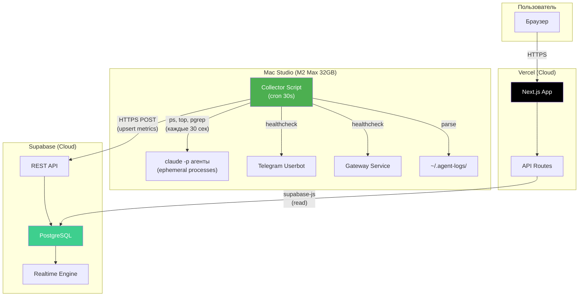
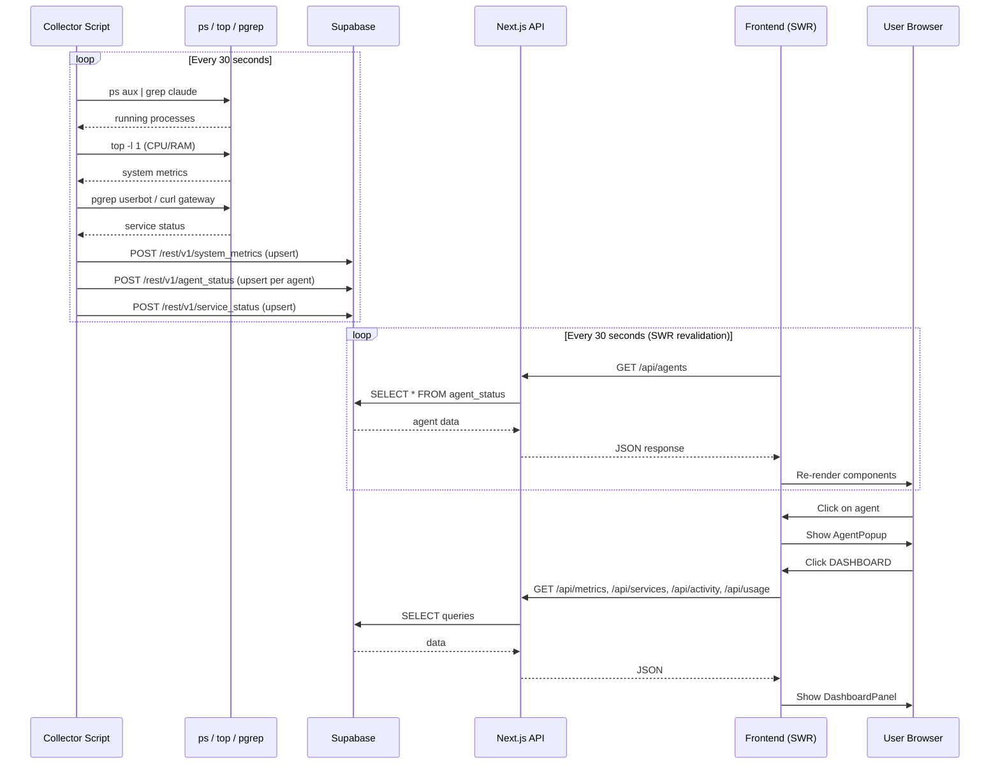
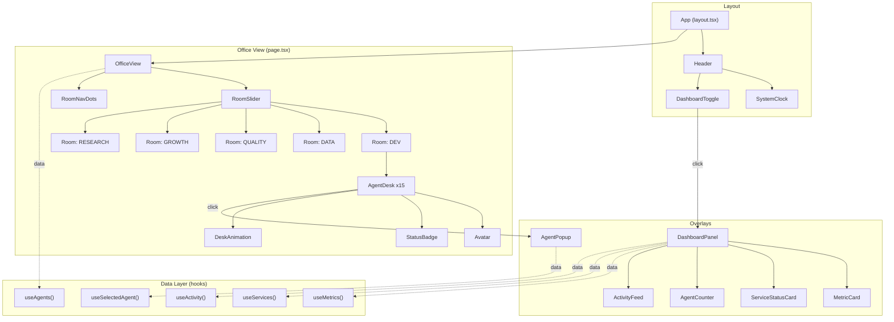

# PLAN.md -- nataly-office-agents

> Автор: Miron (Architect & Lead)
> Дата: 2026-03-15
> Статус: DRAFT -- ожидает утверждения Dan

---

## 1. Финальный Tech Stack

| Слой | Технология | Обоснование |
|------|-----------|-------------|
| Framework | **Next.js 15 (App Router)** | SSR/SSG, API Routes, edge-ready, нативная интеграция Vercel |
| Язык | **TypeScript 5.x** | Type safety, конституция запрещает `any` |
| Стили | **Tailwind CSS 4** | Utility-first, быстрый дизайн, маленький бандл |
| Анимации | **CSS Animations + Framer Motion** | CSS для idle/working loop-анимаций (дешево), Framer Motion для попапов и переходов. Не Lottie (перебор для пиксельного стиля), не PixiJS (перебор для 2D-офиса) |
| Состояние | **React Context + SWR** | SWR для data fetching с auto-revalidation (polling), Context для UI state (выбранный агент, текущая комната). Redux overkill |
| База данных | **Supabase (PostgreSQL + Realtime)** | См. ADR-1 ниже |
| Деплой фронта | **Vercel** | Auto-deploy из GitHub, edge functions, preview deploys |
| Метрики-коллектор | **Shell-скрипт + cron на Mac Studio** | См. ADR-2 ниже |
| Туннель | **Cloudflare Tunnel (cloudflared)** | Безопасный вход на Mac Studio без открытых портов. См. ADR-3 |
| Иконки/Аватарки | **Статические SVG/PNG** | 15 аватарок, отрисованных дизайнером, в /public/avatars/ |

---

## 2. Архитектурные решения (ADRs)

### ADR-1: Supabase -- нужна ли?

**Контекст:** Приложение на Vercel (cloud) должно показывать данные с Mac Studio (локальная машина). Нужен промежуточный слой.

**Варианты:**

| # | Вариант | Плюсы | Минусы |
|---|---------|-------|--------|
| A | Прямой API на Mac Studio через туннель | Простота, real-time | Зависимость от туннеля, нет истории |
| B | **Supabase как хаб данных** | История метрик, Realtime subscriptions, фронт читает из Supabase напрямую (Row Level Security), не зависит от доступности Mac Studio | Дополнительный сервис |
| C | Файл JSON на S3/R2 | Дешево | Нет realtime, костыль |

**Решение: B -- Supabase**

Причины:
1. Mac Studio пушит метрики в Supabase по cron (каждые 30 сек)
2. Next.js читает из Supabase через клиент (или Supabase Realtime для live updates)
3. Если Mac Studio офлайн -- фронт показывает последние известные данные + статус "OFFLINE"
4. Supabase уже настроен в инфраструктуре (токен есть)
5. Бонус: история метрик для графиков "за последние 24 часа"

**Supabase используется для:**
- Хранение текущего статуса агентов (последний heartbeat)
- Метрики Mac Studio (CPU, RAM, uptime)
- Лог последних действий агентов (5-10 записей)
- Статусы сервисов (userbot, gateway)
- Realtime подписка для обновления UI без polling

**Consequences:** Зависимость от Supabase. Нужен коллектор на Mac Studio. Зато фронт полностью serverless.

**Review Date:** 2026-04-15

---

### ADR-2: Сбор метрик с Mac Studio

**Контекст:** Агенты -- не постоянные процессы. Они запускаются как `claude -p` и завершаются. Нужно знать: кто сейчас запущен, загрузка системы, статусы сервисов.

**Решение: Collector-скрипт на Mac Studio, пушит в Supabase**

```
┌────────────────────────────────────────────┐
│  Mac Studio                                │
│                                            │
│  cron (каждые 30 сек):                     │
│    /usr/local/bin/agent-metrics-collector   │
│      ├── ps aux | grep "claude"            │
│      ├── top -l 1 (CPU/RAM)                │
│      ├── проверка userbot процесса          │
│      ├── проверка gateway процесса          │
│      └── curl → Supabase REST API (upsert) │
│                                            │
└────────────────────────────────────────────┘
         │
         ▼ HTTPS (Supabase REST API)
┌────────────────────────────────────────────┐
│  Supabase                                  │
│    table: system_metrics (latest snapshot)  │
│    table: agent_status (per-agent status)   │
│    table: activity_log (recent actions)     │
└────────────────────────────────────────────┘
         │
         ▼ Supabase JS Client / Realtime
┌────────────────────────────────────────────┐
│  Vercel (Next.js)                          │
│    Frontend reads from Supabase            │
└────────────────────────────────────────────┘
```

**Как определяется статус агента:**
- `ps aux | grep "claude"` -- если процесс claude запущен с именем агента в аргументах, агент "РАБОТАЕТ"
- Если процесса нет -- агент "БЕЗДЕЛЬНИЧАЕТ"
- Лог-файлы `~/.agent-logs/actions.log` -- последнее действие каждого агента

**Что собирает collector:**
1. `CPU%` и `RAM%` (через `top -l 1 -s 0` или `vm_stat`)
2. Список процессов `claude` (активные агенты)
3. Статус userbot: `pgrep -f "userbot"` или healthcheck endpoint
4. Статус gateway: `curl -s http://localhost:PORT/health`
5. Uptime: `uptime`
6. Disk usage: `df -h /`

**Review Date:** 2026-04-15

---

### ADR-3: Туннель Mac Studio -- нужен ли?

**Контекст:** Collector пушит данные в Supabase REST API. Туннель не нужен для этого направления.

**Решение: Туннель НЕ нужен на этапе 1.**

Mac Studio --> (outbound HTTPS) --> Supabase. Это работает без туннеля. Supabase -- публичный API.

Туннель понадобится только если мы захотим прямой доступ к Mac Studio из Vercel (например, для выполнения команд). На первом этапе это не нужно.

**Review Date:** 2026-04-15

---

### ADR-4: Realtime обновления UI

**Контекст:** Как фронт получает обновления статуса?

**Варианты:**

| # | Вариант | Плюсы | Минусы |
|---|---------|-------|--------|
| A | Polling (SWR revalidate every 30s) | Простота, надежность | Не мгновенно |
| B | **Supabase Realtime** | Мгновенно, нативно | Чуть сложнее |
| C | SSE через API Route | Контроль | Нужен persistent connection |
| D | WebSocket своей реализации | Полный контроль | Overkill |

**Решение: A на этапе 1 (SWR polling 30s), переход к B (Supabase Realtime) на этапе 2**

Причина: polling 30 сек -- идеально для dashboard. Collector пушит раз в 30 сек, фронт читает раз в 30 сек. Задержка максимум 60 сек -- абсолютно приемлемо для мониторинга.

На этапе 2, если нужно мгновенное обновление -- Supabase Realtime через `supabase.channel()`.

**Review Date:** 2026-04-15

---

### ADR-5: Анимации

**Контекст:** Каждый агент имеет два состояния: работает и бездельничает. Нужны анимации.

**Решение: CSS @keyframes для loop-анимаций + Framer Motion для интерактива**

- "РАБОТАЕТ": CSS `@keyframes` -- мигающий экран монитора, движущиеся руки по клавиатуре, пульсирующий индикатор. Чистый CSS, zero JS overhead.
- "БЕЗДЕЛЬНИЧАЕТ": CSS `@keyframes` -- покачивание на стуле, моргание, зевание.
- Попапы и переходы между комнатами: Framer Motion (`AnimatePresence`, `motion.div`).
- Скролл между комнатами: CSS `scroll-snap-type: x mandatory` + Framer Motion drag gestures.

**Review Date:** 2026-05-01

---

## 3. Архитектура данных (Supabase)

### Таблицы

```sql
-- Снимок метрик Mac Studio (1 строка, upsert)
CREATE TABLE system_metrics (
  id            UUID DEFAULT gen_random_uuid() PRIMARY KEY,
  cpu_percent   REAL NOT NULL,
  ram_percent   REAL NOT NULL,
  ram_used_gb   REAL NOT NULL,
  ram_total_gb  REAL NOT NULL,
  disk_percent  REAL NOT NULL,
  uptime_seconds BIGINT NOT NULL,
  updated_at    TIMESTAMPTZ DEFAULT now()
);

-- Статус каждого агента (15 строк, upsert по agent_id)
CREATE TABLE agent_status (
  agent_id      TEXT PRIMARY KEY,        -- "miron", "backend", etc.
  display_name  TEXT NOT NULL,           -- "Мирон", "Backend Dev"
  model         TEXT NOT NULL,           -- "opus", "sonnet"
  role          TEXT NOT NULL,           -- "Senior Architect"
  room          TEXT NOT NULL,           -- "dev", "data", "quality", "growth", "research"
  status        TEXT NOT NULL DEFAULT 'idle',  -- "working" | "idle"
  current_task  TEXT,                    -- что делает (из лога или аргументов процесса)
  pid           INTEGER,                -- PID процесса claude (null если idle)
  last_active   TIMESTAMPTZ,            -- последняя активность
  updated_at    TIMESTAMPTZ DEFAULT now()
);

-- Статусы сервисов (userbot, gateway, etc.)
CREATE TABLE service_status (
  service_id    TEXT PRIMARY KEY,        -- "userbot", "gateway"
  display_name  TEXT NOT NULL,
  status        TEXT NOT NULL DEFAULT 'unknown',  -- "running" | "down" | "error" | "unknown"
  details       JSONB,                  -- дополнительная инфо
  updated_at    TIMESTAMPTZ DEFAULT now()
);

-- Лог последних действий (circular buffer, хранить 100 записей)
CREATE TABLE activity_log (
  id            BIGSERIAL PRIMARY KEY,
  agent_id      TEXT REFERENCES agent_status(agent_id),
  action        TEXT NOT NULL,           -- "Исследовал конкурентов", "Починил баг #42"
  created_at    TIMESTAMPTZ DEFAULT now()
);

-- Anthropic usage (обновляется вручную или через API)
CREATE TABLE api_usage (
  id            UUID DEFAULT gen_random_uuid() PRIMARY KEY,
  provider      TEXT NOT NULL DEFAULT 'anthropic',
  tokens_used   BIGINT NOT NULL DEFAULT 0,
  tokens_limit  BIGINT,
  cost_usd      REAL,
  period_start  DATE NOT NULL,
  period_end    DATE NOT NULL,
  updated_at    TIMESTAMPTZ DEFAULT now()
);
```

### Seed-данные агентов

15 агентов, предзаполненные в `agent_status`:

| agent_id | display_name | model | role | room |
|----------|-------------|-------|------|------|
| miron | Мирон | opus | Senior Architect & Lead | dev |
| backend | Backend Dev | sonnet | Backend Developer | dev |
| frontend | Frontend Dev | sonnet | Frontend Developer | dev |
| designer | Дизайнер | sonnet | UI/UX Designer | dev |
| data | Data Eng | sonnet | Data Pipeline Specialist | data |
| analyst | Аналитик | sonnet | Data & Business Analyst | data |
| scraper | Скрапер | sonnet | Web Scraping Specialist | data |
| qa | QA | sonnet | QA Engineer | quality |
| security | Безопасник | sonnet | Security Engineer | quality |
| devops | DevOps | sonnet | DevOps Engineer | quality |
| growth | Growth | sonnet | Growth & SEO | growth |
| content | Контент | sonnet | Content Creator | growth |
| ig-oracle | IG Oracle | sonnet | Instagram Expert | growth |
| artem | Артём | opus | Deep Research Agent | research |
| pm | PM | sonnet | Project Manager | research |

---

## 4. Компонентная архитектура React

### Иерархия компонентов

```
<App>
  <Header>
    <Logo />
    <SystemClock />
    <DashboardToggle />         -- кнопка "DASHBOARD"
  </Header>

  <OfficeView>                  -- горизонтальный scroll-контейнер
    <RoomSlider>                -- CSS scroll-snap
      <Room key="dev">
        <RoomLabel text="DEV ROOM" />
        <AgentDesk agent={miron}>
          <Avatar src="/avatars/miron.svg" />
          <AgentName name="Мирон" />
          <StatusBadge status="working|idle" />
          <DeskAnimation status="working|idle" />
        </AgentDesk>
        <AgentDesk agent={backend} />
        <AgentDesk agent={frontend} />
        <AgentDesk agent={designer} />
      </Room>
      <Room key="data">...</Room>
      <Room key="quality">...</Room>
      <Room key="growth">...</Room>
      <Room key="research">...</Room>
    </RoomSlider>
    <RoomNavDots />             -- индикатор текущей комнаты
  </OfficeView>

  <AgentPopup agent={selected}>  -- Framer Motion AnimatePresence
    <PopupAvatar />
    <PopupInfo>
      <RoleBadge />
      <ModelBadge />
      <CurrentTask />
      <LastActive />
    </PopupInfo>
    <CloseButton />
  </AgentPopup>

  <DashboardPanel>              -- slide-in overlay
    <MetricCard title="CPU" value={cpu%} />
    <MetricCard title="RAM" value={ram%} />
    <ServiceStatusCard service="userbot" />
    <ServiceStatusCard service="gateway" />
    <AgentCounter total={15} active={3} />
    <ApiUsageCard tokens={...} />
    <ActivityFeed items={last5} />
    <UptimeCard seconds={...} />
  </DashboardPanel>
</App>
```

### Ключевые хуки

```
useAgents()       -- SWR: GET /api/agents → agent_status[]
useMetrics()      -- SWR: GET /api/metrics → system_metrics
useServices()     -- SWR: GET /api/services → service_status[]
useActivity()     -- SWR: GET /api/activity → activity_log[]
useApiUsage()     -- SWR: GET /api/usage → api_usage
useSelectedAgent() -- Context: текущий выбранный агент (для попапа)
useCurrentRoom()   -- Context: текущая комната (для навигации)
```

---

## 5. API Design (Next.js API Routes)

Все API Routes -- тонкие обертки над Supabase. Они нужны для:
- Скрыть Supabase credentials от клиента (хотя можно и anon key, но API Routes чище)
- Добавить кеширование / rate limiting при необходимости
- Единая точка для будущего расширения

### Endpoints

| Method | Route | Описание | Источник |
|--------|-------|----------|---------|
| GET | `/api/agents` | Все 15 агентов с текущим статусом | `agent_status` |
| GET | `/api/agents/[id]` | Один агент по id | `agent_status` |
| GET | `/api/metrics` | Метрики Mac Studio (CPU/RAM/disk/uptime) | `system_metrics` |
| GET | `/api/services` | Статусы сервисов (userbot, gateway) | `service_status` |
| GET | `/api/activity` | Последние 5-10 действий | `activity_log` (ORDER BY created_at DESC LIMIT 10) |
| GET | `/api/usage` | Anthropic token usage | `api_usage` |
| POST | `/api/collector` | Endpoint для collector-скрипта с Mac Studio | upsert во все таблицы |

### POST /api/collector

Этот endpoint вызывается collector-скриптом с Mac Studio каждые 30 секунд. Защищен bearer token (`COLLECTOR_SECRET` в env).

```json
// Request body:
{
  "system": {
    "cpu_percent": 34.5,
    "ram_percent": 67.2,
    "ram_used_gb": 21.5,
    "ram_total_gb": 32.0,
    "disk_percent": 45.0,
    "uptime_seconds": 864000
  },
  "agents": [
    { "agent_id": "miron", "status": "working", "pid": 12345, "current_task": "Планирование архитектуры" },
    { "agent_id": "backend", "status": "idle", "pid": null, "current_task": null }
  ],
  "services": [
    { "service_id": "userbot", "status": "running" },
    { "service_id": "gateway", "status": "running" }
  ],
  "activity": [
    { "agent_id": "miron", "action": "Создал PLAN.md для nataly-office-agents" }
  ]
}
```

Collector шлет данные напрямую в Supabase REST API (не через Vercel API Route). Это проще и убирает зависимость от Vercel. Но `/api/collector` остается как альтернативный вариант.

**Финальное решение:** Collector --> Supabase REST API напрямую (через supabase-js или curl). API Routes только для чтения фронтом.

---

## 6. Структура папок проекта

```
nataly-office-agents/
├── PLAN.md                          # Этот файл
├── CLAUDE.md                        # Инструкции для агентов
├── .env.local                       # Supabase URL, anon key (gitignored)
├── .env.example                     # Шаблон env переменных
├── .gitignore
├── package.json
├── tsconfig.json
├── tailwind.config.ts
├── next.config.ts
│
├── public/
│   ├── avatars/                     # 15 SVG/PNG аватарок агентов
│   │   ├── miron.svg
│   │   ├── backend.svg
│   │   └── ...
│   ├── rooms/                       # Фоны комнат (опционально)
│   └── favicon.ico
│
├── src/
│   ├── app/
│   │   ├── layout.tsx               # Root layout (шрифты, meta)
│   │   ├── page.tsx                 # Главная страница (OfficeView)
│   │   ├── globals.css              # Tailwind + custom CSS animations
│   │   │
│   │   └── api/
│   │       ├── agents/
│   │       │   ├── route.ts         # GET /api/agents
│   │       │   └── [id]/
│   │       │       └── route.ts     # GET /api/agents/:id
│   │       ├── metrics/
│   │       │   └── route.ts         # GET /api/metrics
│   │       ├── services/
│   │       │   └── route.ts         # GET /api/services
│   │       ├── activity/
│   │       │   └── route.ts         # GET /api/activity
│   │       └── usage/
│   │           └── route.ts         # GET /api/usage
│   │
│   ├── components/
│   │   ├── office/
│   │   │   ├── OfficeView.tsx       # Горизонтальный scroll-контейнер
│   │   │   ├── Room.tsx             # Одна комната с агентами
│   │   │   ├── RoomLabel.tsx        # Название комнаты
│   │   │   └── RoomNavDots.tsx      # Навигация по комнатам
│   │   │
│   │   ├── agent/
│   │   │   ├── AgentDesk.tsx        # Стол агента (аватар + имя + статус + анимация)
│   │   │   ├── Avatar.tsx           # Аватарка
│   │   │   ├── StatusBadge.tsx      # "РАБОТАЕТ" / "БЕЗДЕЛЬНИЧАЕТ"
│   │   │   ├── DeskAnimation.tsx    # Анимации рабочего/idle состояния
│   │   │   └── AgentPopup.tsx       # Попап с деталями агента
│   │   │
│   │   ├── dashboard/
│   │   │   ├── DashboardPanel.tsx   # Slide-in панель дашборда
│   │   │   ├── MetricCard.tsx       # Карточка метрики (CPU, RAM)
│   │   │   ├── ServiceStatusCard.tsx # Статус сервиса
│   │   │   ├── AgentCounter.tsx     # Счетчик агентов
│   │   │   ├── ApiUsageCard.tsx     # Anthropic usage
│   │   │   ├── ActivityFeed.tsx     # Последние 5 действий
│   │   │   └── UptimeCard.tsx       # Аптайм
│   │   │
│   │   └── ui/
│   │       ├── Header.tsx           # Шапка
│   │       ├── DashboardToggle.tsx  # Кнопка DASHBOARD
│   │       └── SystemClock.tsx      # Часы
│   │
│   ├── hooks/
│   │   ├── useAgents.ts
│   │   ├── useMetrics.ts
│   │   ├── useServices.ts
│   │   ├── useActivity.ts
│   │   ├── useApiUsage.ts
│   │   ├── useSelectedAgent.ts
│   │   └── useCurrentRoom.ts
│   │
│   ├── lib/
│   │   ├── supabase.ts              # Supabase client (server + browser)
│   │   └── constants.ts             # Конфиг агентов, комнат, интервалов
│   │
│   ├── types/
│   │   └── index.ts                 # TypeScript типы (Agent, Metrics, etc.)
│   │
│   └── data/
│       └── agents.ts                # Статическая конфигурация 15 агентов
│
├── collector/
│   ├── agent-metrics-collector.sh   # Bash-скрипт для Mac Studio cron
│   └── install.sh                   # Установка cron job
│
└── supabase/
    └── migrations/
        └── 001_initial_schema.sql   # SQL миграция с таблицами
```

---

## 7. Группировка агентов по комнатам

| Комната | Название | Агенты | Цвет/тема |
|---------|---------|--------|-----------|
| dev | DEV ROOM | @miron, @backend, @frontend, @designer | Синий / мониторы, код |
| data | DATA ROOM | @data, @analyst, @scraper | Зеленый / графики, таблицы |
| quality | QUALITY ROOM | @qa, @security, @devops | Красный / щиты, замки |
| growth | GROWTH ROOM | @growth, @content, @ig-oracle | Оранжевый / ракеты, соцсети |
| research | RESEARCH ROOM | @artem, @pm | Фиолетовый / книги, доски |

Расстановка внутри комнат: 2-4 стола в ряд, каждый стол = один агент. Комната research -- 2 агента, остальные 3-4.

---

## 8. Deployment Plan

### GitHub Setup

```
1. git init
2. gh repo create nataly-office-agents --private --source=. --remote=origin
3. git add . && git commit -m "Initial project setup"
4. git push -u origin main
```

### Vercel Setup

```
1. npx vercel link (привязать к проекту)
2. Vercel auto-detects Next.js
3. Env vars в Vercel Dashboard:
   - NEXT_PUBLIC_SUPABASE_URL
   - NEXT_PUBLIC_SUPABASE_ANON_KEY
   - SUPABASE_SERVICE_ROLE_KEY (для API routes, серверный)
   - COLLECTOR_SECRET (для POST /api/collector)
4. Production branch: main
5. Preview deploys: любой PR
```

### Supabase Setup

```
1. Создать проект "nataly-office-agents" в Supabase Dashboard
2. Запустить миграцию 001_initial_schema.sql
3. Seed agent_status с 15 агентами
4. Настроить RLS (Row Level Security):
   - agent_status: SELECT для anon (публичное чтение)
   - system_metrics: SELECT для anon
   - INSERT/UPDATE только для service_role key
5. Сохранить URL и ключи в .env.local и Vercel
```

### Mac Studio Collector Setup

```
1. Скопировать collector/agent-metrics-collector.sh на Mac Studio
2. chmod +x agent-metrics-collector.sh
3. Установить cron: */1 * * * * /path/to/agent-metrics-collector.sh
   (каждую минуту; внутри скрипта -- 2 вызова с паузой 30 сек для интервала 30 сек)
4. Env vars для скрипта:
   - SUPABASE_URL
   - SUPABASE_SERVICE_KEY
```

### CI/CD Flow

```
Developer pushes to feature branch
  → Vercel preview deploy (auto)
  → Preview URL для тестирования

PR merged to main
  → Vercel production deploy (auto)
  → Доступно по домену
```

---

## 9. Mermaid-диаграммы

### 9.1. Общая архитектура системы



### 9.2. Data Flow



### 9.3. Компонентная архитектура React



---

## 10. Этапы реализации

### Этап 1: MVP (3-5 дней работы агентов)

1. **Setup** -- Next.js проект, Tailwind, структура папок, GitHub, Vercel
2. **Supabase** -- создать проект, миграция, seed данных агентов
3. **API Routes** -- 5 GET endpoints, чтение из Supabase
4. **Collector** -- bash-скрипт, установка cron на Mac Studio
5. **UI: OfficeView** -- 5 комнат, горизонтальный скролл, заглушки агентов
6. **UI: AgentDesk** -- аватарки (placeholder), имена, статус-бейджи
7. **UI: AgentPopup** -- попап при клике
8. **UI: Dashboard** -- панель с метриками
9. **Анимации** -- CSS idle/working, Framer Motion попап/дашборд
10. **Polish** -- адаптивность, mobile, шрифты

### Этап 2: Улучшения (после MVP)

- Кастомные аватарки от @designer
- Supabase Realtime вместо polling
- Anthropic API usage (парсинг billing page или API)
- История метрик (графики за 24 часа)
- Звуковые эффекты (typing, notification)
- Темная тема / переключение

---

## 11. Env-переменные

```env
# .env.local (gitignored)
NEXT_PUBLIC_SUPABASE_URL=https://xxx.supabase.co
NEXT_PUBLIC_SUPABASE_ANON_KEY=eyJ...
SUPABASE_SERVICE_ROLE_KEY=eyJ...

# Collector (на Mac Studio)
SUPABASE_URL=https://xxx.supabase.co
SUPABASE_SERVICE_KEY=eyJ...
```

---

## 12. Открытые вопросы для Dan

1. **Домен** -- нужен кастомный домен или хватит `*.vercel.app`?
2. **Аватарки** -- рисуем кастомные или берем готовые (например, pixel art генератор)?
3. **Anthropic Usage** -- есть ли API для получения usage данных, или парсить billing page?
4. **Userbot / Gateway** -- на каких портах healthcheck? Как проверить их статус?
5. **Кто такой ig-oracle** -- Instagram Expert, но что конкретно мониторить?
6. **Мобильная версия** -- нужна ли адаптивность или десктоп only?
7. **Аутентификация** -- дашборд публичный или нужен пароль? (рекомендую хотя бы basic auth)

---

## 13. Риски и митигация

| Риск | Вероятность | Влияние | Митигация |
|------|------------|---------|-----------|
| Mac Studio офлайн -- метрики не обновляются | Средняя | Средний | UI показывает "Last updated: X min ago" + статус OFFLINE если >5 min |
| Supabase free tier лимиты | Низкая | Высокий | Collector шлет только дельты, хранить 24h данных, удалять старое |
| `ps aux | grep claude` -- ненадежное определение агента | Высокая | Средний | Парсить аргументы процесса, искать `--profile` или имя агента |
| 15 аватарок долго рисовать | Средняя | Низкий | Этап 1: placeholder иконки, Этап 2: кастомные от дизайнера |

---

> **Следующий шаг:** Dan утверждает план, затем Miron делегирует:
> - @frontend -- UI компоненты (Этап 1, пункты 5-10)
> - @backend -- API Routes + Supabase setup (пункты 2-3)
> - @devops -- Collector скрипт + cron + GitHub/Vercel (пункты 1, 4, 6)
> - @designer -- Аватарки агентов, цветовая схема комнат
